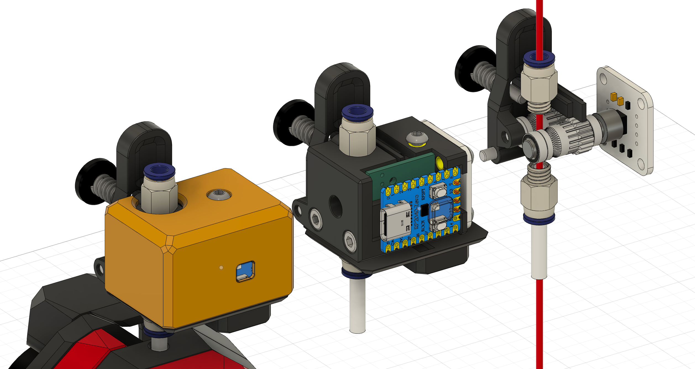
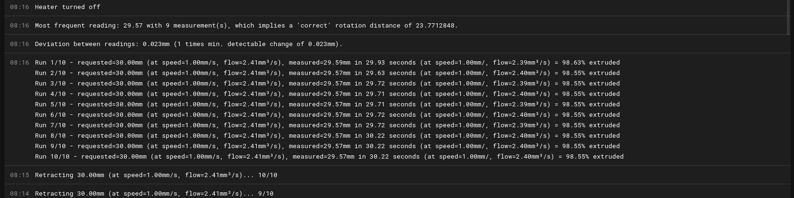
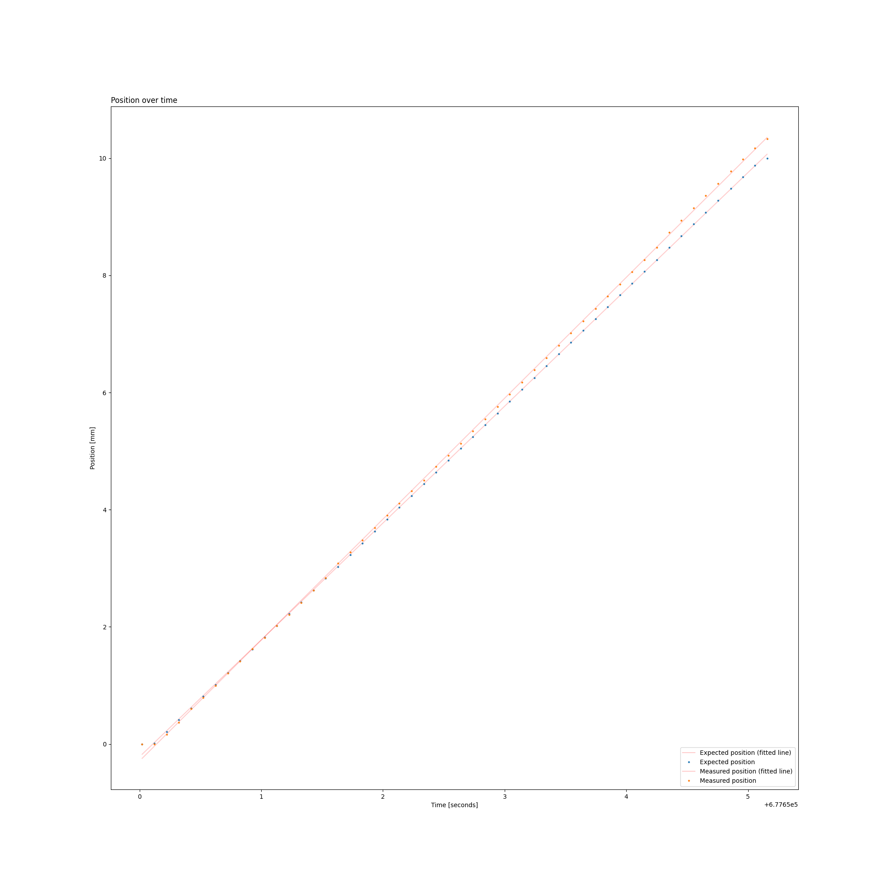
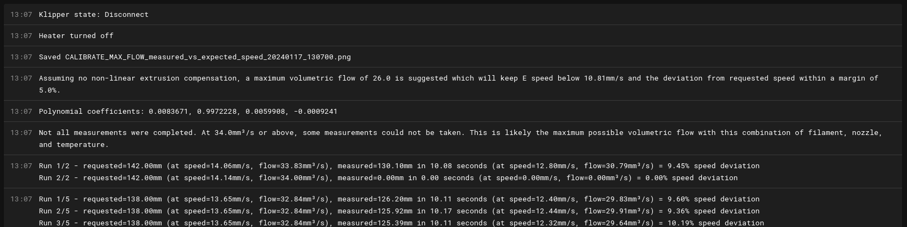
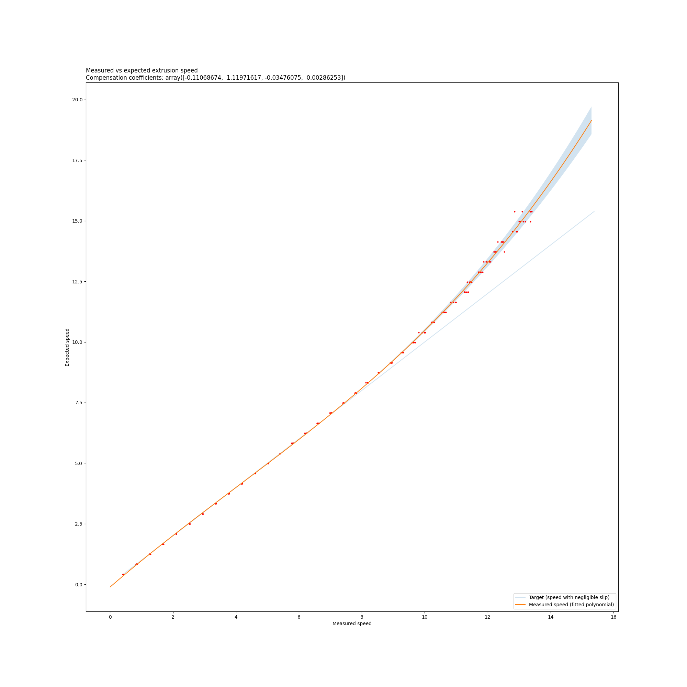

# Roadrunner: a high resolution filament motion sensor



### Features

* **High resolution** sub-millimeter motion detection
* **Low cost** at approx. ~12$ USD for parts on Aliexpress
* **Detect direction** (extruding or reversing) unlike pulse-based motion sensors
* Detect changes of **0.7 degree** or 0.04mm based on a 24mm rotation distance
* **Neopixel status indicator** for filament removed, filament inserted, filament moving
* **Small and light** at half the size of some commercial products
* **Helps determine runout reason** between filament runout, filament jams, or partial under-extrusion
* **2-wire communication** with mcu, over UART or I2C (suits most boards)
* **Calibrates max flow** with helpful gcode command.

Most 3D printer motion sensors are bulky, slow to trigger, prone to false positives, and have a high detection distance meaning a large amount material is extruded before actually detecting a runout, leading to poor layer adhesion and failed prints after a runout.

The Roadrunner motion sensor is based on a magnetic rotary encoder which can detect sub-millimeter movement in the filament for accurate extrusion length measurement, in addition to an IR sensor which can instantly detect filament runout. With the combination of both sensors and a dedicated RP2040-Zero board for collecting data, the Roadrunner can detect which type of issue is affecting a print, between simply reaching the end of a spool, the filament no longer moving, or the filament moving but at a lower than expected rate of extrusion.

By leveraging the higher precision of the sensor, it's possible to determine the length, speed and volumetric flow that are expected and compare them to the actual measured values in real time which gives us a reasonable approximation of _how much_ the filament is being under-extruded by. A simple to use `CALIBRATE_MAX_FLOW` command is provided to perform free-air extrusion tests and automatically benchmark the maximum volumetric flow of any temperature/nozzle/material combination.

### Build guide

This is an open-source project, so you can build your own!

See the [bill of material](manual/BOM.md) and the [assembly manual](manual/ASSEMBLY.md).

### Klipper installation

Clone the repository and create a symlink to the sensor code:

```
cd ~
git clone --depth 1 --single-branch https://github.com/EiNSTeiN-/roadrunner-filament-sensor.git
~/roadrunner-filament-sensor/install.sh
```

Restart klipper for the new sensor type to be recognized:
```
sudo service klipper restart
```

To get automatic updates within moonraker, add the following block at the end of `moonraker.conf`:
```ini
[update_manager roadrunner-filament-sensor]
type: git_repo
path: ~/roadrunner-filament-sensor
origin: https://github.com/EiNSTeiN-/roadrunner-filament-sensor.git
install_script: install.sh
primary_branch: main
managed_services: klipper
```

### Configuration

Add the following configuration to your `printer.cfg`:

```
[high_resolution_filament_sensor roadrunner]
extruder: extruder
#  The extruder to which this sensor is attached
uart_rx_pin: P0.0
uart_tx_pin: P0.1
#  TX and RX pins for UART communication, leave out if i2c is used (see below).
#i2c_address: 64
#  The address of the sensor on the I2C bus, the default is 64 (0x40). Only
#  change this if you attach more than one sensor on the same I2C bus.
#i2c_mcu: mcu
#  The mcu on which the sensor is connected.
#i2c_bus: i2c1
#  The I2C bus to which the sensor is connected on the mcu.
#i2c_timeout: 30000
#  The time after which an I2C timeout error is thrown.
pause_on_runout: False
#  Whether or not to pause the print automatically when a runout
#  condition is triggered.
runout_gcode: RESPOND TYPE=command MSG='Filament runout detected'
#  The gcode to execute when a runout condition is detected.
invert_direction: False
# If the measured distance/speed values are negative, change this to True.
rotation_distance: 23.4
# The length of filament which corresponds to a full 360 degree rotation
# of the magnet over the rotary encoder. A good starting point is the
# circumference of the BMG gears in the sensor.
underextrusion_max_rate: 0.5
# What rate of underextrusion can be tolerated, as a value between 0.0 and 1.0.
# The rate is calculated by comparing the extruder position to the measured
# filament length over a certain period. A rate of 0.0 means the measured
# filament motion matches the expected extrusion distance over the period.
# A rate of 1.0 means no filament motion was detected at all when some motion
# was expected for the extruder.
underextrusion_period: 5
# How long should the underextrusion rate stay above the max rate before
# a runout is triggered.
hysteresis_bits: 3
# How many bits to ignore from the magnetic rotary encoder's angle data.
# This setting determines the minimum detectable change in position
# for the sensor. Configuring this too low can result in flapping between
# two adjacent positions even when the filament is not moving.
```

### Usage

##### Calibration cheat sheet

Here's an example of a complete calibration workflow:

```
# Disable a few things for these tests
SET_PRESSURE_ADVANCE EXTRUDER=extruder ADVANCE=0
SET_Z_THERMAL_ADJUST TEMP_COEFF=0 ENABLE=0

# Optionally home the printer and move to a safe Z
G32
G0 Z100

# Check your sensor info
QUERY_FILAMENT_SENSOR SENSOR=roadrunner

# Find rotation_distance value, don't forget to save it in the sensor config & restart.
CALIBRATE_FILAMENT_SENSOR_ROTATION_DISTANCE SENSOR=roadrunner TEMP=250 LENGTH=30 SPEED=120 COUNT=2

# Find max flow for this extruder, save the graph of collected data for future reference (THIS WILL TAKE A WHILE)
CALIBRATE_MAX_FLOW SENSOR=roadrunner TEMP=250 START=1 STOP=40 SAVE_GRAPH=1

# Measure a G1 command at a high speed (e.g. 11.5mm/s = 690mm/m).
# Use a value that will produce a flow in the non-linear part of the curve in the previous graph.
FILAMENT_SENSOR_MEASURE SENSOR=roadrunner TEMP=250 SPEED=690 LENGTH=100 SAVE_GRAPH=1

# Enable nonlinear extrusion with coefficients suggested by `CALIBRATE_MAX_FLOW`
ENABLE_NONLINEAR_EXTRUSION SENSOR=roadrunner ENABLE=1 COEFFICIENTS=-0.1106867,1.1197162,-0.0347608,0.0028625

# Take same measurement again, the measured length and speed should show little deviation.
FILAMENT_SENSOR_MEASURE SENSOR=roadrunner TEMP=250 SPEED=690 LENGTH=100 SAVE_GRAPH=1

# Now check the result of the extrusion compensation by generating a new graph (THIS WILL TAKE A WHILE)
CALIBRATE_MAX_FLOW SENSOR=roadrunner TEMP=250 START=1 STOP=40 STEP=2 COUNT=2 SAVE_GRAPH=1
```

##### Calibrate the sensor's rotation distance:

The first thing to do is to calibrate the `rotation_distance` for the sensor itself. This is done
with `CALIBRATE_FILAMENT_SENSOR_ROTATION_DISTANCE`:

```
CALIBRATE_FILAMENT_SENSOR_ROTATION_DISTANCE SENSOR=roadrunner TEMP=250 LENGTH=30 SPEED=60 COUNT=10
```

* `TEMP`: The temperature to heat up the extruder heater at. Default is 200.
* `LENGTH`: The length of filament to retract. Default is 25.
* `SPEED`: The extrusion speed, in rotation per minute (e.g. 300 means 5mm/s). Default is 30 (0.50mm/s).
* `COUNT`: How many times to perform the test. Default is 10.

This macro will heat up the extruder heater to the specified temperature, retract the filament multiple times,
and calculate some stats. The measurement is done while retracting the filament to avoid introducing an error
due to the back-pressure in the nozzle. Make sure a length of filament at least `LENGTH` mm long can
be retracted while still being gripped by the extruder gears. For best results, perform this test at low
speed over a distance long enough for the sensor's gears can do one full rotation.

After the distance measurements are taken, they are sorted by frequency and the measurement with the highest frequency is used to calculate a new `rotation_distance`. For example, if 8/10 measurements read 25.62mm when 25mm was expected, the `rotation_distance`
was too high and a new value is automatically suggested. After saving the new `rotation_distance` in your sensor configuration, repeating the test with the same macro parameters should measure the correct distance. The deviation between measurements is reported relative to the minimum detectable change in position, a small deviation indicates repeatable measurements. While the sensor is
high precision, its accuracy and repeatability over multiple readings can be affected by real world factors such as
springiness in the PTFE tube, the attachement of the sensor to the body of the extruder, etc.



##### Measure a G1 command

Extrude some filament using a G1 command, and print the result as measured by the sensor.

```
FILAMENT_SENSOR_MEASURE SENSOR=roadrunner TEMP=250 LENGTH=10 SPEED=120 COUNT=1
```

* `TEMP`: The temperature to heat up the extruder heater at. Default is 200.
* `LENGTH`: The length of filament to retract. Default is 10.
* `SPEED`: The extrusion speed, in rotation per minute (e.g. 300 means 5mm/s). Default is 120 (2mm/s).
* `COUNT`: How many times to perform the test. Default is 1.
* With the `SAVE_GRAPH=1` parameter, a graph of all measurements is saved to klipper's current working directory (usually `~/klipper/`).

The macro will run one or more G1 command until the desired length of filament is extruded. The macro will print stats for each move, as measured by the sensor.

Optionally if a graph is saved, the output will look like this:



##### Max flow calibration

The goal of this macro is to help determine the maximum volumetric flow for a given combination of filament, nozzle and temperature. Before starting, make sure your extruder's configured `filament_diameter` is correctly configured, as well as the sensor's `rotation_distance`. For best results, the `STOP` value should be above or near the top of your extruder's expected maximum volumetric flow rate.

```
CALIBRATE_MAX_FLOW SENSOR=roadrunner TEMP=250 START=1 STOP=50 SAVE_GRAPH=1
```

* `TEMP`: The temperature to heat up the extruder heater at. Default is 200.
* `DURATION`: How long to extrude for during each test, used to determine the extrusion length (length = speed * duration). Default is 10 seconds.
* `START`: The minimum volumetric flow to test. Default is 5.
* `STOP`: The maximum volumetric flow to test. Default is 25.
* `STEP`: The amount by which to increment the volumetric flow between each test. Default is 1.
* `COUNT`: How many times to perform the test for each volumetric flow value. Default is 5.
* `MAX_SPEED_DEVIATION`: The percentage of deviation between the expected and the measured speed that will be considered acceptable. Used for recommending a maximum volumetric flow. Default is 0.05 (5%).
* With the `SAVE_GRAPH=1` parameter, a graph of all measurements is saved to klipper's current working directory (usually `~/klipper/`).



This macro will warn when a given volumetric flow was so high that not all measurements could be taken at this rate. This often corresponds to the physical limit of the extruder, where the back-pressure is so high that the extruder cannot keep up and eats into the filament.

After the measurements are taken, this macro will look for a range of speeds where the deviation between the expected and measured speeds is below `MAX_SPEED_DEVIATION` percent. At higher speeds, the back-pressure in the nozzle will cause under-extrusion, this can be identified visually in the data graph (use `SAVE_GRAPH=1`) as a part of the curve where the exected and measured speeds start deviating sharply. A polynomial curve is fitted to the relationship between the expected vs measured speeds, which can be used to compensate for the under-extrusion at higher speeds.

Optionally if a graph is saved, the output will look like this:



##### Enable non-linear extrusion compensation (EXPERIMENTAL)

When non-linear extrusion compensation is enabled, the increase in pressure in the extruder will be compensated by increasing the requested speed of G1 commands. This applies to both extrude-only moves as well as regular printing moves. The compensation is only applied when using relative coordinates and only when a positive E distance is specified since retraction moves are not affected by pressure in the nozzle.

```
ENABLE_NONLINEAR_EXTRUSION SENSOR=roadrunner ENABLE=1 COEFFICIENTS=-0.1106867,1.1197162,-0.0347608,0.0028625
```

* `ENABLE`: 1 to enable, 0 to disable
* `COEFFICIENTS`: A list of comma-separated polynomial coefficients.
